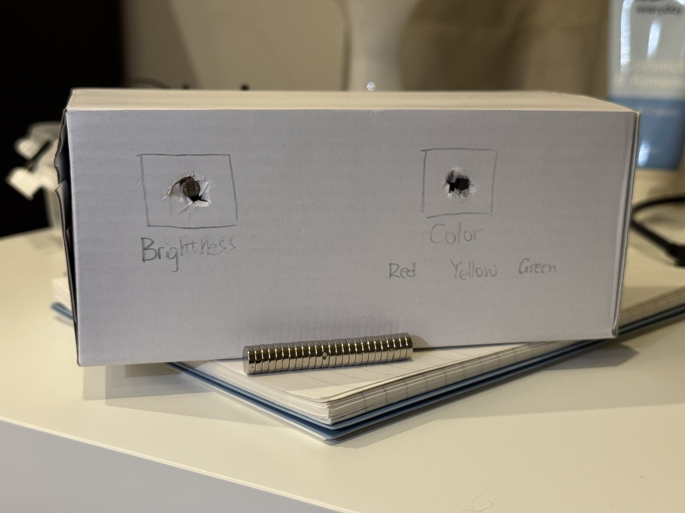
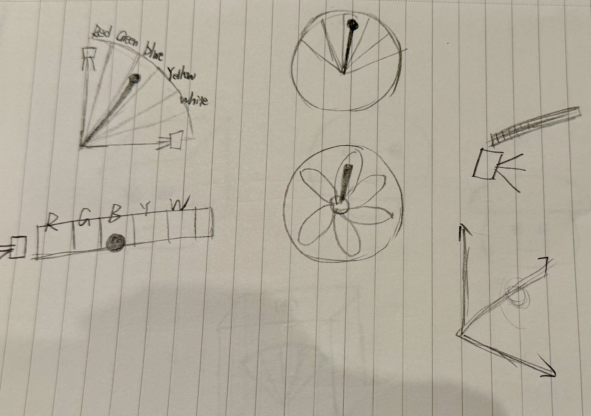
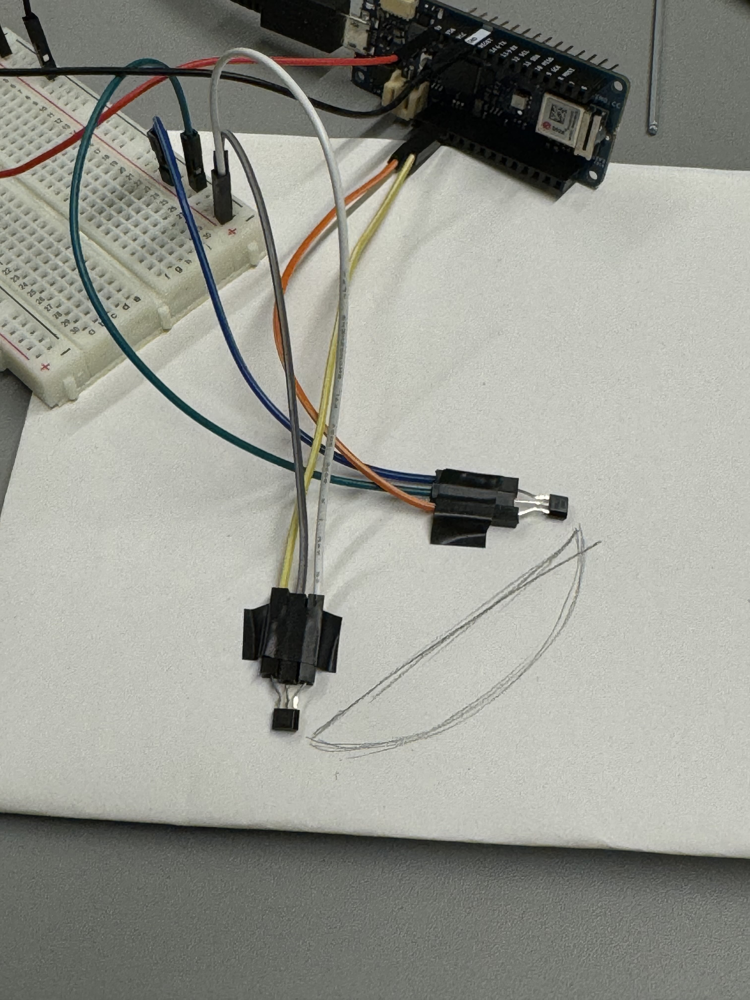
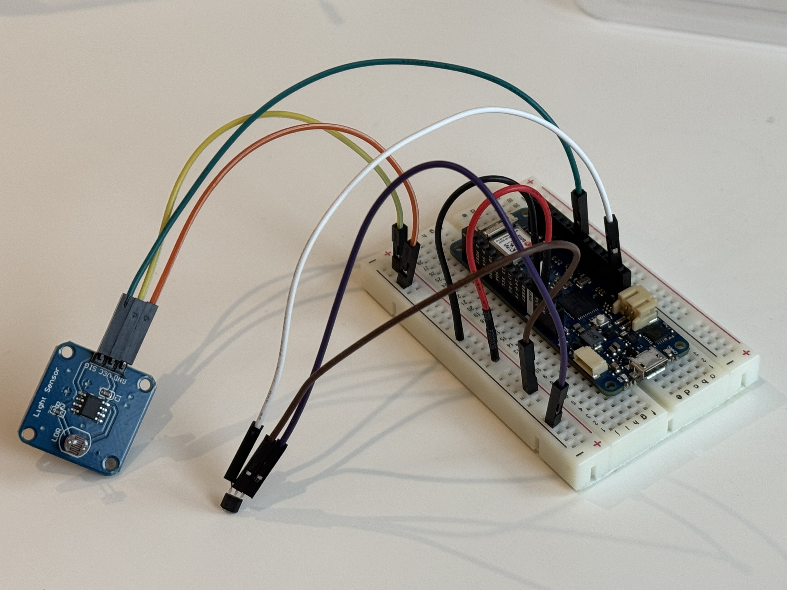
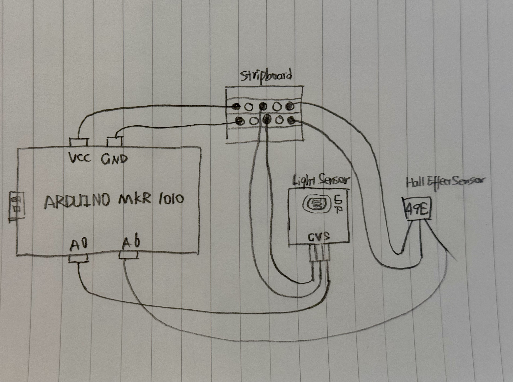

# casa0014ChronoLumina--LightMag Harmony

An eye-friendly light controller which can automatically adjust the brightness of the Chrono Lumina Blinker based on the ambient light level. 

Under normal conditions, the light is soft yellow. When the ambient light becomes stronger, the light will dim; when the ambient light is dark, the light will become brighter. 
You can also change the color of the light with magnets.

# inspiration
Because the lighting in my dormitory is very dim, my eyes often feel strained after looking at the electronic screen for a while. That’s why I really hope to have a light  that allows me to freely adjust the brightness. I would prefer higher brightness for studying and a softer, more natural light in daily life.

# what I have learned
I found a Hall sensor in the lab, and after searching online, I found it has many applications in our daily lives, such as wireless headphone cases and speed dial in cars. It can detect changes in the strength and direction of magnetic fields.

# Sketch of the prototype

# The hardware used: 
Arduino MKR1010; 

LDR Light Sensor; 

Hall Sensor SS49E

## Attempts in using the hall sensor

# Breadboard Circuit

# Stripbpard Circuit Diagram

# How it works
1. A LDR Light Sensor is used to detect ambient light level to control the brightness of the Chrono Lumina Blinker. 
When strong ambient light(analog value > 800) is detected, the blinker is dimmed(brightness = 50) to act as an ambient light.
When moderate ambient light(400 < analog value < 800) is detected, the blinker’s brightness is soft(brightness = 90), simulating natural light.
When low ambient light(analog value < 400) is detected, the blinker’s  brightness becomes larger(brightness = 119), providing clear illumination.

2. A Hall Sensor is used to detect changes in the magnetic field to change the color of Chrono Lumina Blinker. Under a normal magnetic field, the colour of the blinker is yellow. When a strong magnetic field(analog value > 550) is detected, the blinker changes to green, and when a weak magnetic field(analog value < 350) is detected, it changes to red.

# Reference
Principle and Application of Hall sensor: https://www.electronics-tutorials.ws/electromagnetism/hall-effect.html

Characteristics of light sensor: https://www.electronics-tutorials.ws/io/io_4.html
