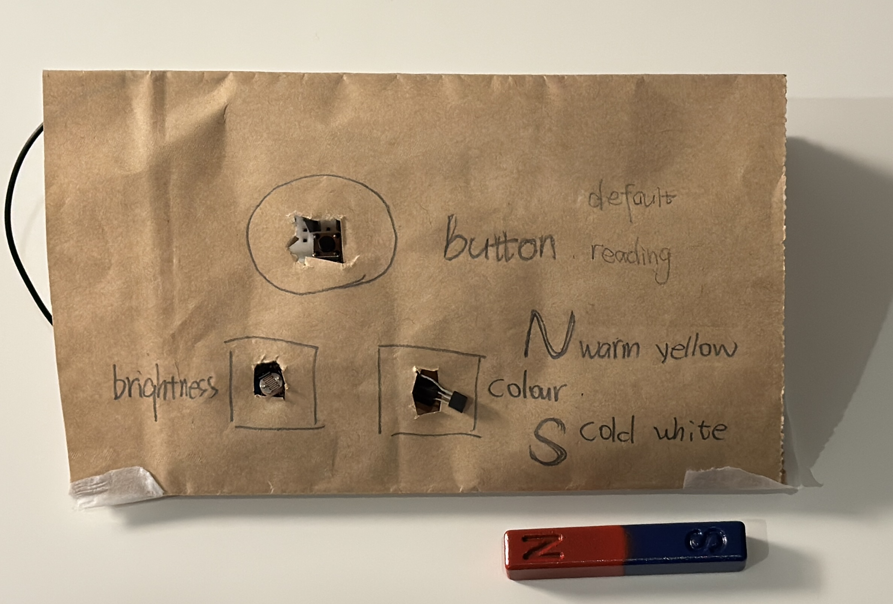
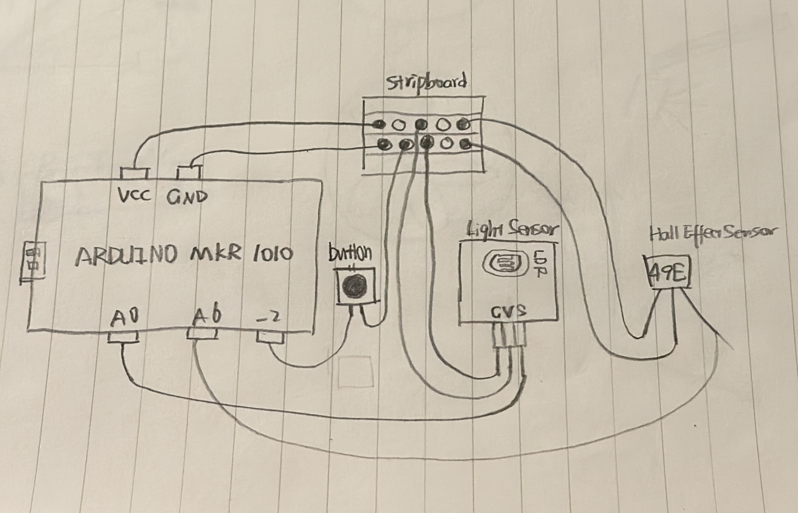

# CASA0014 ChronoLumin--LightMag Harmony

LightMag Harmony means that ChronoLumina adjusts the brightness and colour under the joint action of light and magnetic fields to present a harmonious lighting effect.

Under normal conditions, the light is soft yellow. 
In the default mode, the light will change with the change of ambient light. When the ambient light becomes stronger, the light will be brighter; when the ambient light is darker, the light will dim. In reading mode, when the ambient light becomes stronger, the light will dim; when the ambient light is dim, the light will be brighter. In addition, the colour tone of the light will be changed according to the change of the magnetic field to meet the needs of different colours. When the N pole of the magnet approaches, the light turns warm yellow. When the S pole of the magnet is close, the light turns cold white.

# Inspiration
Because the lighting in my dormitory is very dim, my eyes often feel strained after looking at the electronic screen for a while. That’s why I really hope to have a light  that allows me to freely adjust the brightness. I would prefer higher brightness for studying and a softer, more natural light in daily life.

# What I have learned
I found a Hall sensor in the lab, and after searching online, I found it has many applications in our daily lives, such as wireless headphone cases and speed dial in cars. It can detect changes in the strength and direction of magnetic fields.

# Sketch of the prototype

# The hardware used: 
Arduino MKR1010; 

LDR Light Sensor; 

Hall Sensor SS49E

## Attempts in using the hall sensor

# Breadboard Circuit

# Stripbpard Circuit Diagram

# How it works
1.A LDR Light Sensor is used to detect ambient light level to control the brightness of the Chrono Lumina Blinker.  
In the default mode, when strong ambient light(analog value > 800) is detected, the blinker will become brighter(brightness = 119), providing clear illumination.
When moderate ambient light(400 < analog value < 800) is detected, the blinker’s brightness is soft(brightness = 90), simulating natural light.
When low ambient light(analog value < 400) is detected, the blinker will dim(brightness = 50) to act as an ambient light.  
In reading mode, when strong ambient light(analog value > 800) is detected, the blinker is dimmed(brightness = 50) to act as an ambient light.
When moderate ambient light(400 < analog value < 800) is detected, the blinker’s brightness is soft(brightness = 90), simulating natural light.
When low ambient light(analog value < 400) is detected, the blinker’s  brightness becomes larger(brightness = 119), providing clear illumination.

2.A Hall Sensor is used to detect changes in the magnetic field to change the color of Chrono Lumina Blinker. Under a normal magnetic field, the colour of the blinker is yellow. When a strong magnetic field(analog value > 550) is detected, the blinker changes to warm yellow, and when a weak magnetic field(analog value < 350) is detected, it changes to cold white.

## full video    

# Reference
Principle and Application of Hall sensor: https://www.electronics-tutorials.ws/electromagnetism/hall-effect.html

Characteristics of light sensor: https://www.electronics-tutorials.ws/io/io_4.html
